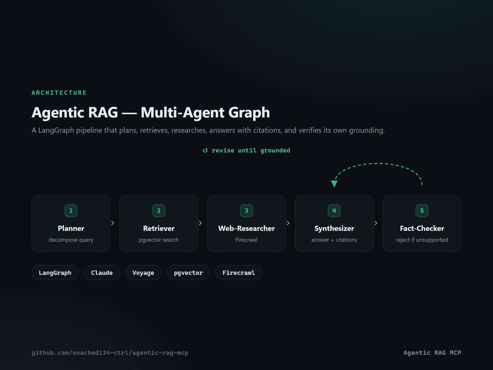
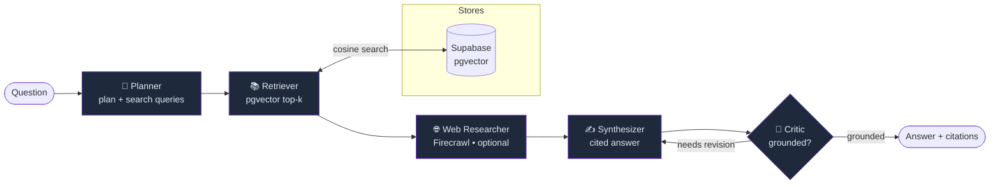
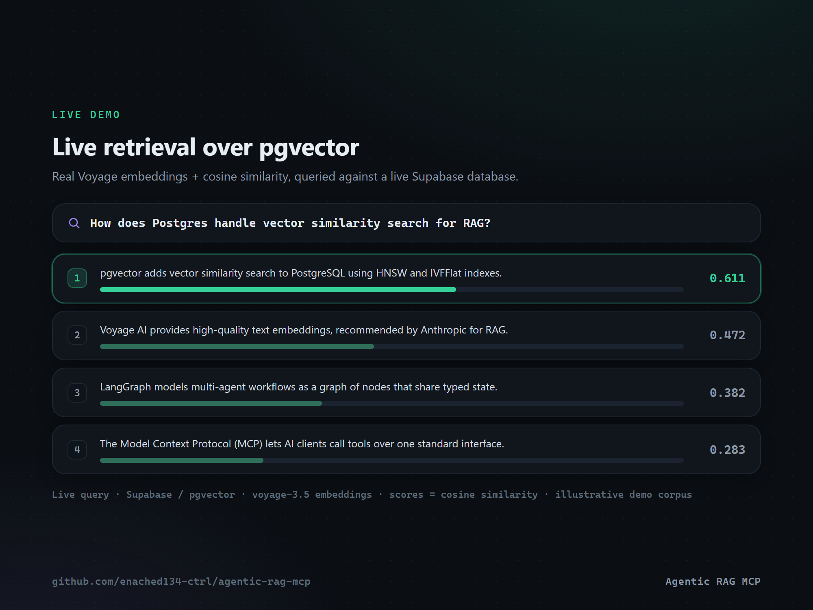

# Agentic RAG MCP

[](https://github.com/enached134-ctrl/agentic-rag-mcp/actions/workflows/ci.yml)
[](LICENSE)
[](https://www.python.org/)
[](https://modelcontextprotocol.io)

<p align="center">
  
</p>

A **multi-agent Retrieval-Augmented Generation system exposed as an MCP server**. Ask a
question and a [LangGraph](https://langchain-ai.github.io/langgraph/) pipeline plans the
retrieval, pulls evidence from a **pgvector** knowledge base, optionally augments it with
live web research, drafts a **cited** answer, and then **self-critiques** it for grounding —
revising until the answer is supported by the sources.

It plugs into any MCP client (Claude Code/Desktop, Cursor, Windsurf, …) as three tools:
`ingest`, `ask`, and `search`.

> **Why this design?** A bare RAG endpoint is easy to copy; a *multi-agent system that
> verifies its own answers and ships as an MCP server* is not. The architecture is the moat —
> "easy to buy, hard to replicate."

---

## Architecture



| Agent | Model / tool | Responsibility |
|---|---|---|
| **Planner** | Claude (`claude-opus-4-8`, adaptive thinking) | Decompose the question into focused search queries |
| **Retriever** | Voyage embeddings + pgvector | Cosine top-k over the knowledge base |
| **Web Researcher** | Firecrawl *(optional)* | Augment with live web results when a key is set |
| **Synthesizer** | Claude | Draft an answer grounded in context, with `[n]` citations |
| **Critic** | Claude | Verify grounding; loop back for revision if unsupported |

---

## MCP tools

| Tool | Arguments | Returns |
|---|---|---|
| `ingest` | `url: str` | Scrapes the URL, chunks + embeds it, stores it. `{ url, chunks_added }` |
| `ask` | `question: str` | Runs the full pipeline. `{ answer, citations, plan, grounded }` |
| `search` | `query: str, k: int = 5` | Retrieval only — top-k chunks with similarity scores |

---

## Quickstart

```bash
# 1. Install (Python 3.10+)
uv venv && uv pip install -e ".[dev]"     # or: pip install -e ".[dev]"

# 2. Configure
cp .env.example .env                       # fill in ANTHROPIC_API_KEY, VOYAGE_API_KEY, DATABASE_URL

# 3. Create the vector table (Supabase SQL editor or psql)
psql "$DATABASE_URL" -f sql/schema.sql

# 4. Run the MCP server (stdio by default)
agentic-rag-mcp
```

### Connect it to Claude Code

```bash
claude mcp add agentic-rag -s user \
  --env ANTHROPIC_API_KEY=sk-ant-... \
  --env VOYAGE_API_KEY=pa-... \
  --env DATABASE_URL=postgresql://... \
  -- agentic-rag-mcp
```

Then, from the client: *"ingest https://example.com/docs"* → *"ask: how do I configure X?"*.

---

## How it works

1. **Plan** — Claude turns the question into a short plan + 1–5 search queries.
2. **Retrieve** — each query is embedded (Voyage `voyage-3.5`) and matched against pgvector
   by cosine distance; results are de-duplicated and ranked.
3. **Research** — if `FIRECRAWL_API_KEY` is set, live web results are added to the context.
4. **Synthesize** — Claude writes an answer grounded *only* in the numbered context, citing
   each claim as `[n]`.
5. **Critique** — a strict fact-checker pass decides whether the answer is fully supported.
   If not (and revisions remain), it loops back to the synthesizer with feedback.

Configurable via env: `RAG_MODEL`, `RAG_TOP_K`, `RAG_MAX_REVISIONS`, `RAG_EMBED_MODEL`.

<p align="center">
  
</p>
<p align="center"><sub>Live retrieval over pgvector — Voyage embeddings, real cosine similarity (illustrative demo corpus).</sub></p>

---

## Evaluation

Answer quality is tracked with [promptfoo](https://promptfoo.dev) — faithfulness, citation
presence, and latency — so quality is measured, not asserted:

```bash
cd evals && promptfoo eval -c promptfooconfig.yaml
```

See [`evals/`](evals/) for the rubric and test cases.

---

## Deploy

Containerised and ready for [Railway](https://railway.app) (HTTP transport):

```bash
railway up        # uses Dockerfile + railway.json; set RAG_TRANSPORT=http
```

Expose `RAG_HTTP_PORT` and connect over `--transport http`. A `cloudflared` tunnel works for
local demos.

---

## Project layout

```
src/agentic_rag_mcp/
  config.py      # env-driven settings
  llm.py         # Anthropic (Claude) helper — adaptive thinking, JSON parsing
  embeddings.py  # Voyage embeddings
  store.py       # pgvector store (psycopg)
  web.py         # Firecrawl web research (optional)
  ingest.py      # chunking + ingestion
  state.py       # LangGraph state
  nodes.py       # planner / retriever / researcher / synthesizer / critic
  graph.py       # graph assembly
  server.py      # FastMCP server (ingest / ask / search)
sql/schema.sql   # pgvector schema
evals/           # promptfoo eval suite
```

## License

MIT — see [LICENSE](LICENSE).
