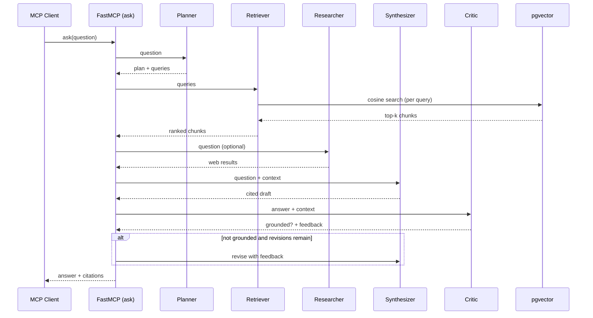

# Architecture

The system is a small **stateful graph of specialised agents** (LangGraph) wrapped behind the
Model Context Protocol. The MCP layer exposes three tools; everything else is internal.

## Design decisions

- **Multi-agent over single-shot.** The planner/critic split is what lifts answer quality and
  trust: the critic catches unsupported claims a single generation would emit.
- **Embeddings via Voyage.** Anthropic has no embeddings endpoint and recommends Voyage; the
  store dimension (1024) matches `voyage-3.5`.
- **pgvector on Supabase.** Postgres-native vector search — one database for vectors + metadata,
  no extra infra. HNSW index for approximate cosine search.
- **MCP as the interface.** The same pipeline is callable from any MCP client and is trivially
  re-deployable per client — the reusable, sellable unit.
- **Bounded revision loop.** `RAG_MAX_REVISIONS` caps the synthesizer↔critic loop so latency
  and cost stay predictable.

## Extending

- Swap the chunker in `ingest.py` for a structure-aware splitter.
- Add a reranker between `retrieve` and `synthesize`.
- Add a `multiagent` fan-out for parallel sub-questions.
